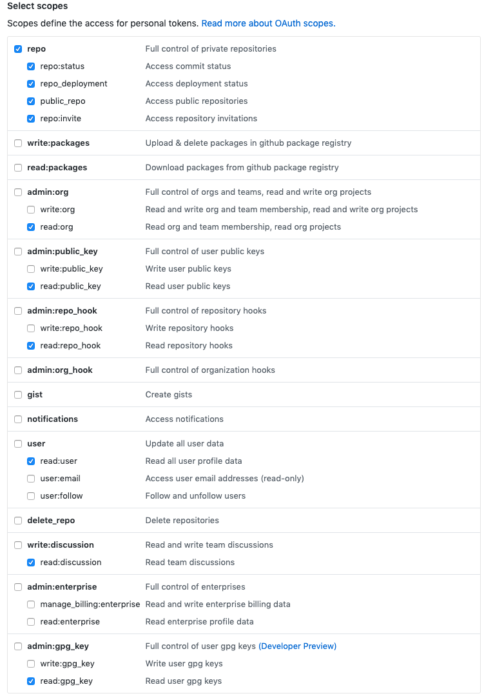

# Project Wimbledon

Project Wimbledon is an attempt to fix and possibly automate the REG group's planning and billing process.

This repo is used to build the web app hosted at https://wimbledon-planner.azurewebsites.net/, which includes recent versions of:

* [Projects whiteboard](https://wimbledon-planner.azurewebsites.net/projects)

* [People whiteboard](https://wimbledon-planner.azurewebsites.net/people)

* [Demand vs capacity plot](https://wimbledon-planner.azurewebsites.net/demand_vs_capacity)

* [GitHub Preferences](TODO)

To update the data used by the web app go to https://wimbledon-planner.azurewebsites.net/update. This will take a couple of minutes after which you should get the message `DATA UPDATED!`

The app is currently IP restricted to only be accessible at The Alan Turing Institute.

## Redeploying the Web App

The web app at https://wimbledon-planner.azurewebsites.net/ is built from the master branch of this repo. To update and redeploy it:

1. Commit a change to master (**Only tested changes should be added to master**, as changes on master automatcially trigger rebuilds to start).
2. The Docker image will automatically start to rebuild. It's hosted on DockerHub as [jack89roberts/WimbledonPlanner](https://hub.docker.com/repository/docker/jack89roberts/wimbledon-planner/builds).
3. Once the image has rebuilt DockerHub tries to rebuild the app, but the webhook fails as the Web App management is IP restricted to the Turing. Instead you need to trigger it to rebuild in the portal.
4. Go to https://portal.azure.com/
5. Browse to Subscriptions -> WimbledonPlanner -> Resource Groups -> wimbledon-planner-production
6. Select the wimbledon-planner App Service resource.
7. Click "Stop", and then "Start".
8. In a new tab go to https://wimbledon-planner.azurewebsites.net/ (it won't load as the app service is starting/rebuilding)
9. Back in the portal tab, click on "Container Settings" in the lefthand menu of the wimbledon-planner app service.
10. It may take 5 minutes or so to appear but eventually if you refresh the logs you should see a "Pulling image from Docker hub" entry, and then eventually a "Application started" entry.
11. To get the forecast data into the web app and create the visualisations, go to https://wimbledon-planner.azurewebsites.net/update and wait for the "DATA UPDATED!" message.

## Requirements

Wimbledon Planner is designed to run on **Python 3.7**, using Python 3.6 may give errors due to some changes to the subprocess library between the two.

Python package dependencies are listed in requirements.txt and can be installed by running this from the parent directory of the repo:
```bash
> pip3 install -r requirements.txt
```

For converting the HTML whiteboard visualisations to PDFs the command line tool `wkhtmltopdf` is required.
To install it on Mac OS (assuming `brew` is installed), and its ghostscript dependency, run:
```bash
> brew cask install ghostscript wkhtmltopdf
```

To test/run WimbledonPlanner with a local database you will need postgresql installed in your system, which can also be installed with brew:
```bash
> brew install postgresql
```

`brew` can be installed from the Turing self service app, or from here: https://brew.sh/

## Configuration

Wimbledon Planner searches for configuration info in environment variables or in the `~/.wimbledon/` directory in the user's home directory. Functionality to set and get various configuration parameters is provided in `wimbledon/config.py`. The Azure web app uses environment variables passed into the Docker container via an Azure key vault.

 **Do not check any configuration information into version control**. Parameters are stored in a separate directory (or as environmet variables) to help prevent this. The `.gitignore` file for this repo is also setup to ignore any file with a `.token` or `.secrets` extension.

### Harvest

Wimbledon requires account IDs and a token to query the Harvest and Forecast APIs. This is stored in the file
`~/.wimbledon/.harvest_credentials`, which is a json file with the following structure:
```json
{"harvest_account_id":  "<HARVEST_ACCOUNT_ID",
 "forecast_account_id":  "<FORECAST_ACCOUNT_ID",
 "access_token": "<ACCESS_TOKEN>"}
```

You can either create this file yourself or use the `set_harvest_credentials` function in `wimbledon/config.py`.
Alternatively, they can be stored in the environment variables `HARVEST_ACCOUNT_ID`, `FORECAST_ACCOUNT_ID` and `HARVEST_ACCESS_TOKEN`.

To get the tokens:
1) Go to https://id.getharvest.com/developers and login (ask Oliver about making an account if you don't have one).
2) Click "Create New Personal Access Token"
3) Name the token after the machine you are creating the secrets for.
4) To get the Harvest account key, ensure that you have selected "Harvest - The Alan Turing Institute" under "Choose Account"
5) To get the Forecast account key, ensure that you have selected "Forecast - The Alan Turing Institute" under "Choose Account"

### SQL

Wimbledon Planner interacts with data stored in a **postgresql** database. Functions used to update the database rely on postgres specific functions in sqlalchemy so are unlikely to work with other database types. It also expects the database to be called `wimbledon` and for the schema of the database to match the one defined in `wimbledon/sql/schema.py`.

The configuration of the database to use is set by the file `~/.wimbledon/.sql_config`, which is a json file with the following structure:
```json
{"drivername": "postgresql",
 "host": "<HOSTNAME>",
 "database": "wimbledon",
 "username": "<USERNAME>",
 "password": "<PASSWORD>",
 "port": "<PORT>"}
```
You can either create this file yourself or use the function `set_sql_config` in `wimbledon/config.py`.
Alternatively you can use the environment variables `WIMBLEDON_DB_DRIVER`, `WIMBLEDON_DB_HOST`, `WIMBLEDON_DB_DATABASE`, `WIMBLEDON_DB_PORT`, `WIMBLEDON_DB_USER` and `WIMBLEDON_DB_PASSWORD`.

#### Local database

If you want wimbledon to use a local database on your system the SQL configuration should be set as follows (or via the equivalent environment variables):
```json
{"drivername": "postgresql",
 "host": "localhost",
 "database": "wimbledon"}
```
The port, username and password are not needed in this case.

However, you will also need to create the database on your system. To do that, run:
```bash
> cd wimbledon/sql
> bash create_localhost.sh
```
This creates a postgresql server at `/usr/local/var/postgres` on your system with a `wimbledon` database on it and the schema defined by `wimbledon/sql/schema.py`. If you'd like to check this worked you can connect to the database with the postgres command-line tool:
```bash
> psql wimbledon
```
When connected you can try things like `\d` to list the tables of the database, or `\d people` to list the columns of the people table.

If you reboot your system you may need to start the postgres server again:
```bash
> pg_ctl -D /usr/local/var/postgres -l logfile start
```

The app and notebooks wil update the database by default to add data to it, but if you'd like to trigger this manually you can run:
```bash
> cd wimbledon/harvest
> python db_interface.py
```

If you want to delete an old database and create a new clean one you can run:
```bash
> cd wimbledon/sql
> bash delete_db.sh
> bash create_localhost.sh
```

#### Azure/other database

To setup wimbledon to use an Azure/some other remote database you will need to define all the relevant parameters for your server (drivername, host, database, username, password and port) in `~/.wimbledon/.sql_config` or as the relevant environment variables.

The web app uses an Azure Database for PostgreSQL server, with the necessary parameters passed in to the app service container from an Azure key vault.

### GitHub

Wimbledon requires a GitHub token to query the GitHub API. This is stored in the file `~/.wimbledon/.github_credentials`, which is a json file with the following structure:
```json
{"token":  "<GITHUB TOKEN>"}
```

Since Wimbledon retrieves preference information from https://github.com/alan-turing-institute/Hut23, you must have access to this repository for your token to work.

To create an access token, [follow this guide](https://help.github.com/en/articles/creating-a-personal-access-token-for-the-command-line) and select the following scopes:



## Interactive Notebooks

The Jupyter notebooks `visualise_forecast.ipynb` and `visualise_harvest.ipynb` in the `notebooks` directory get the
 latest Harvest/Forecast data and display the visualisations, including some interactive widgets
  to customise/display plots for individual projects, individual people etc.

 The `reg_capacity_vs_demand.ipynb` notebook creates the REG capacity vs. project demand history & forecast plot.

 The `github_api.ipynb` notebook shows how the project preference/ availability table is generated.

## App

The app running at https://wimbledon-planner.azurewebsites.net/ is defined by the file `app/app.py` in the parent directory of this repo. Configuration for the app is set using environment variables passed in to the container from a key vault.

To run the app locally instead you can run:

```bash
> cd app
> python app.py <LOCALPATH_TO_WIMBLEDONPLANNER_REPO>
```

Once the app is running you should see a message like `Running on http://0.0.0.0:8000/ (Press CTRL+C to quit)`. Open the given URL in your browser to use the app.

### Updating the app authentication secret

See https://github.com/alan-turing-institute/WimbledonPlanner/issues/44#issuecomment-717846378
