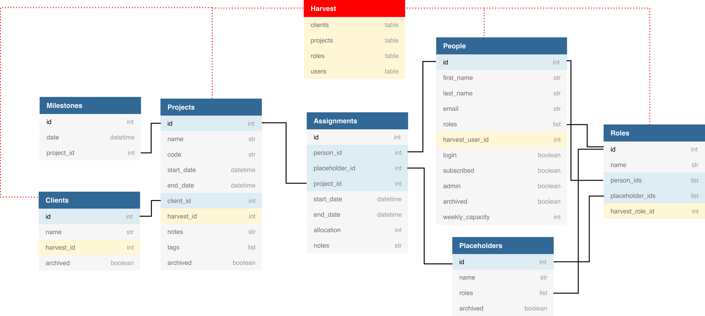

# Forecast Data Model

The diagram below summarises fields in the eight main tables in the Forecast data,
and highlights where there are links to the Harvest data.
Some fields are not shown, either because they are irrelevant/not particularly
meaningful for us (e.g. people have a colour blindness flag) or just to keep
the diagram clean.
Fields not shown that may be useful are mentioned in the table descriptions below.
There are also a few additional tables, for example a connections table which
lists the last time each user logged in.

The visualisations (whiteboard etc.) are created from data in the **Projects**,
**People**, **Placeholders** and **Assignments** tables only.

### People

One entry for each person. We have to pay for Forecast per person, currently
(April 2019) we have 26 people listed.

A person has a first name, last name, email, one or
more roles (e.g. Research Data Scientist) and flags to show which days they
work (not shown in the diagram above - one True/False value for each day of the
  week, currently used to mark weekends as days off).

There are several other flags that we don't currently use but may be useful.
In particular:
* **Weekly capacity** - not filled so currently assume everyone is 8 hours/day,
5 days per week.
* **Archived** - boolean indicating whether a user has been archived.
This seems to be the right way to deal with people that have left but we're not
making use of it currently (possibly for some reason that we've forgotten).
Archived people don't count towards the total number of users for billing purposes.

People also have a `harvest_id` to link them with their Harvest data.

### Placeholders

Placeholders are treated separately to "full" users, having their own table as
 well as a separate column in the Assignments table (`person_id` distinct from
 `placeholder_id`).
 Forecast limits the number of placeholders to one per every four full users.
 We currently have placeholders for "Resource Required" and
 external institutes (Newcastle, Edinburgh, Birmingham, Leeds).

 Placeholders have less functionality than people (users).
 In particular:
 * They don't have a weekly capacity.
 * They work 7 days a week (can't be flagged as having days off).

### Roles

 Contains each unique job title (e.g. Research Data Scientist,
   Principal Research Software Engineer) and lists of which person IDs
   have these titles.

 Roles also have a `harvest_id` to link them with their Harvest data.

### Projects

One entry per project.
Projects have a name, a client, a start date, and an end date.
They can also be archived and have a code (distinct from the id), e.g.
R-NATS-001 (are these Finance codes?)

There are also fields for tags and notes - we don't use these but they could be
a place to include e.g. GitHub links or general project keywords/techniques.

Projects also have a `harvest_id` to link them with their Harvest data.

### Clients

Each entry defines the name of a client, which is a property of the projects.
Examples of clients include: "The Alan Turing Institute", "Hut 23", "Health",
and "Intel".

Clients also have a `harvest_id` to link them with their Harvest data.

### Milestones

A project can have milestone dates. We don't use this currently.

### Assignments

Each entry defines an allocation (in seconds per day) of a person or placeholder
 (exactly one of `person_id` and `placeholder_id` are defined) to a given project
 between a start date end date.

The allocation value is fixed (if someone's allocation to a project varies during
its duration they will have multiple entries in the Assignments table for that
project.)

## The Forecast API

Foreacst does not have a public API, see https://help.getharvest.com/forecast/faqs/faq-list/api/

However, there is a stable enough private/hidden API for some wrappers to have
been developed.
One example is `pyforecast`, which is described as a work in progress
but seems to work ok. See https://github.com/vafliik/pyforecast

The scripts `api/update.py` and `api/DataUpdater.py` use `pyforecast` to extract
and save all Forecast data to csv files.

## Issues / "Features"

* Projects don't have have a concept of the resources they require; this can only
be inferred from the users and placeholders that have been allocated to them.

* People don't have start and end dates.
This makes dealing with past leavers and future joiners very difficult.

## Diagram/Schema

To see, edit or export the diagram above go to:
https://dbdiagram.io/d/5cbf2115f7c5bb70c72fba4b
