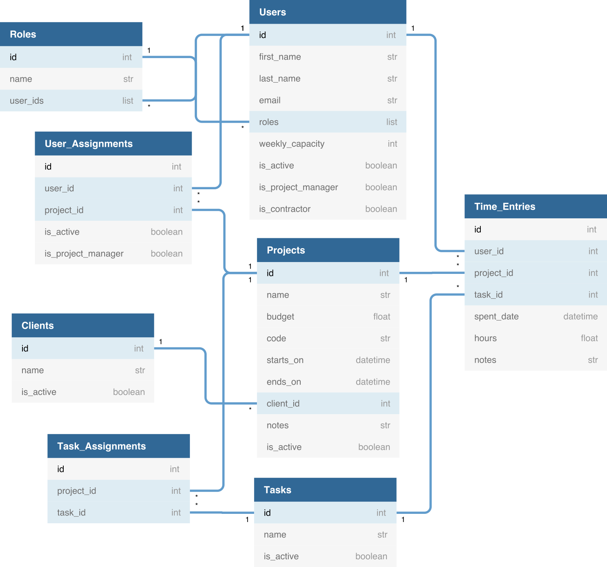

# Harvest Data Model

Tables the `api/save.py` and `api/DataUpdater.py` scripts query:
* Clients
* Tasks
* Task Assignments
* Time Entries
* Projects
* Roles
* Users
* User Assignments

From these tables, the ones used to make visualisations by scripts in the `/vis`
folder are **Time Entries**, **Projects**, **Tasks**, **Clients** and **Users**.

Other tables that are not queried at all (and I believe are mostly empty for us
   in any case) include:
* Invoices
* Estimates
* Expenses
* ...possibly others.

The tables and relationships between them are summarised in the diagram below.
Most of the tables also have fields for whether an entry is budgeted or not, and at
what hourly rate. I haven't included these in the diagram. There is information
in the billable flags, but I'm not sure by what criteria these have been entered
(or whether it's just random).

Note there is no explicit reference to Forecast in the Harvest data. Links between
the two are only possible via `harvest_ids` present in the Forecast data.

### Clients

Clients have an id and a name, and include the likes of "Wellcome Trust",
"Alan Turing Institute", "Health", "Hut 23" and "Trac days".

### Projects

Projects have an id, name, start date and end date, and belong to a `client_id`.
They also have a `budget` field to define the total amount of time to be spent
on that project, which is currently unfilled for most projects.

### Tasks

Tasks have an id and name and can be assigned to multiple projects (see Task
  Assignments). Tasks include "Meetings", "Programming", "Documentation",
  "Team events", "Leave", etc.

### Task Assignments

Each entry links a `task_id` to a `project_id`. A project can have an arbitrary
number of tasks assigned to it.

### Users

Users have an id, first and last names, an email, and can have one or more roles
like in Forecast. They also have a weekly capacity (in seconds, generally 144000
for 8 hours/day, 5 days/week), and can be flagged as being a project manager and
active or inactive.

### Roles

Roles include the likes of "Research Project Manager", "Research Data Scientist"
etc., and the entry for each role contains a list of `user_ids` having that role.

### User Assignments

Each entry links a `user_id` to a `project_id`. A project can have an arbitrary
number of users assigned to it. The project manager can be indicated with the
`is_project_manager` flag.

### Time Entries

Each time entry corresponds to a number of `hours` spent on a specific `spent_date`
by one `user_id`, on one `project_id`, on a specific `task_id`.
As there's a row for each task on each project on each day, users will typically
have something like 10 rows in the time entries table per week.

## The Harvest API  

Harvest has a public API which is quite well documented, see:
https://help.getharvest.com/harvest/integrations/other-integrations/harvest-api/

The status of wrappers for interacting with the API is not as good, but libraries
do exist for multiple languages, including python.
The `api/save.py` and `api/DataUpdater.py` scripts make use of `python-harvest`,
available here: https://github.com/lionheart/python-harvest

However, this was originally developed for the old v1 version of the API,
 with the v2 version on a development branch which is partially complete and
 liable to break with new commits.
 For now, we are installing a specific version of the v2 branch, which mostly
 works, with the command: `pip install python-harvest-redux==5.0.0b0`

If we plan to rely on it for some future application we should switch to some stable,
fully working future version, which hopefully will be developed, or write/contribute
something ourselves.

The way `python-harvest` returns data means many of the tables above are already
merged, e.g. the returned "Time Entries" table contains user, project and task
names, not only their ids.

## Issues / "Features"

* Getting the Harvest data is slow, mostly because of the Time Entries table
which currently has about 3700 entries. This must be split across 37 API queries
(max 100 results per query) taking about 2 seconds each.
The size of this table  will continue to grow rapidly (by about 5-10 entries
per person per week), so the situation will only get worse.
Could move to a model where only data in a date range of interest is queried,
but that would then make calculating cumulative time tracked across a project's
whole duration (and comparing to Forecast) more difficult. Probably where having
our own database would make the biggest difference.

## Diagram Link

https://dbdiagram.io/d/5cb5a0b0f7c5bb70c72fa5c9
