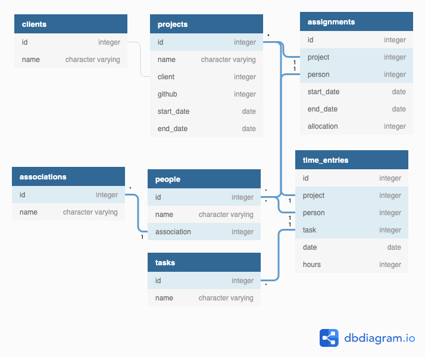

The diagram below represents the minimal set of tables and columns from the Harvest and Forecast data models (combined) needed to recreate everything that Wimbledon Planner does at the moment. This is my starting point for replacing the backend with a database rather than CSVs.

Update 23rd Aug 2019: Current data model is as above but with additional capacity column in people table indicating someone's nominal availability for projects.
